# 9 Principles of Ultralearning

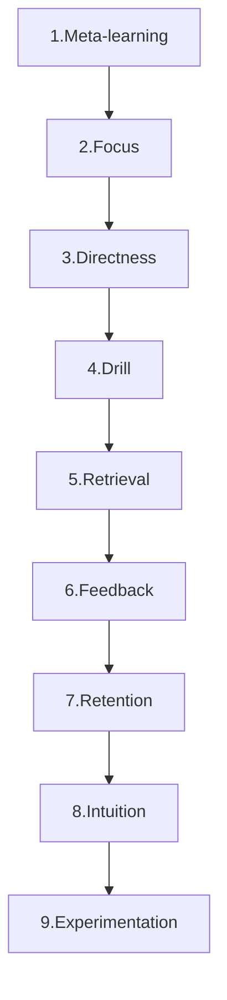
```mermaid
flowchart TB
    1.Meta-learning-->2.Focus-->3.Directness-->4.Drill-->5.Retrieval-->6.Feedback-->7.Retention-->8.Intuition-->9.Experimentation
```

## 1. Meta-learning

- Use 10% of learning a subject (pre-learning a subject).
- Beware of ***Diminishing Return & Marginal Output***.

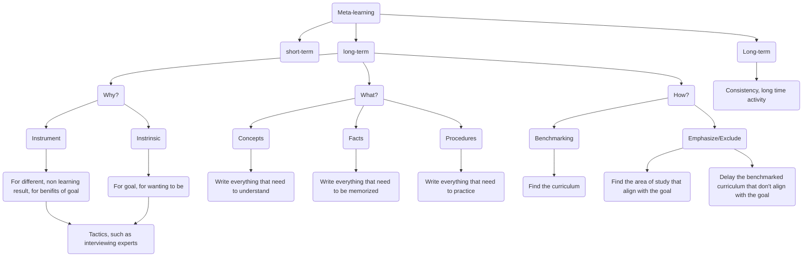
```mermaid
flowchart TB
    a(Meta-learning)
    b(short-term)
    c(long-term)
    c1(Why?)
    c2(What?)
    c3(How?)
    c11(Instrument)
    c111(For different, non learning result, for benifits of goal)
    c12(Instrinsic)
    c121(For goal, for wanting to be)
    c1combine(Tactics, such as interviewing experts)
    c21(Concepts)
    c211(Write everything that need to understand)
    c22(Facts)
    c221(Write everything that need to be memorized)
    c23(Procedures)
    c231(Write everything that need to practice)
    c31(Benchmarking)
    c311(Find the curriculum)
    c32(Emphasize/Exclude)
    c321(Find the area of study that align with the goal)
    c322(Delay the benchmarked curriculum that don't align with the goal)
    d(Long-term)
    e(Consistency, long time activity)
    a-->b
    a-->c
    a-->d-->e
    c-->c1
	c-->c2
	c-->c3
	c1-->c11-->c111
	c1-->c12-->c121
	c111-->c1combine
	c121-->c1combine
	c2-->c21-->c211
	c2-->c22-->c221
	c2-->c23-->c231
	c3-->c31-->c311
	c3-->c32
	c32-->c321
	c32-->c322
```

## 2. Focus

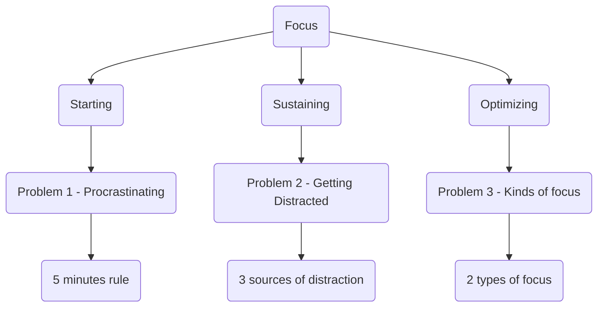
```mermaid
flowchart TB
    a(Focus)
    b(Starting)
    c(Sustaining)
    d(Optimizing)
    b1(Problem 1 - Procrastinating)
    b11(5 minutes rule)
    c1(Problem 2 - Getting Distracted)
    c11(3 sources of distraction)
    d1(Problem 3 - Kinds of focus)
    d11(2 types of focus)
    a-->b-->b1-->b11
    a-->c-->c1-->c11
    a-->d-->d1-->d11
```
### 5 minutes rule

The 5-minute rule is a method to overcome procrastination by committing to a task for just five minutes.

**The method is simple:**

1. Pick the task you're avoiding
    
2. Commit to working on it for ONLY 5 minutes
    
3. After 5 minutes, give yourself complete permission to stop
    
Here's why it works:

- The hardest part of any task is starting
    
- Five minutes feels psychologically "safe" - not a big commitment
    
- Once you begin, momentum often carries you forward
    
- Even if you do stop after 5 minutes, you've still made progress
### 3 Sources of Distractions

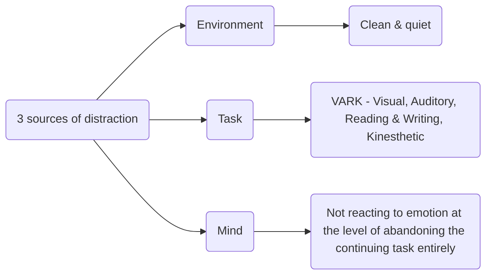
```mermaid
flowchart LR
    a(3 sources of distraction)
    b(Environment)
    b1(Clean & quiet)
    c(Task)
    c1(VARK - Visual, Auditory, Reading & Writing, Kinesthetic)
    d(Mind)
    d1(Not reacting to emotion at the level of abandoning the continuing task entirely)
    a-->b-->b1
    a-->c-->c1
    a-->d-->d1
```

### 2 types of focus (kinds of focus)

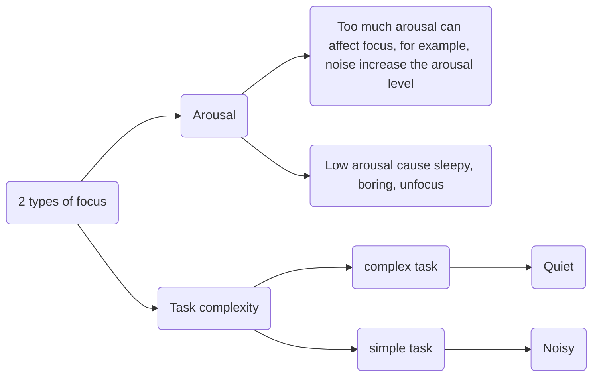
```mermaid
flowchart LR
    a(2 types of focus)
    b(Arousal)
    b1(Too much arousal can affect focus, for example, noise increase the arousal level)
    b2(Low arousal cause sleepy, boring, unfocus)
    c(Task complexity)
    c1(complex task)
    c11(Quiet)
    c2(simple task)
    c21(Noisy)
    a-->b
    b-->b1
    b-->b2
    a-->c
    c-->c1-->c11
    c-->c2-->c21
```

## 3. Directness

- Most important resources for passing class (for passing test) is not lectures (lectures are important though) but ***problem sets***.
- The principle of directness: doing the thing you want to be good at when much of a learning take place.
- Learn by doing directly
- Create an artificial project or environment to test your skill, if there is not real project or environment available at the time.
- Face the challenge.
### 3 tactics of how to learn directly

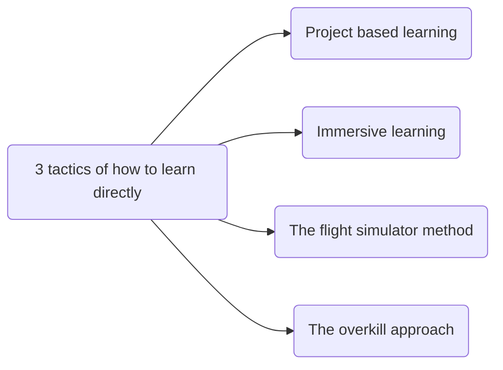
```mermaid
flowchart LR
    a(3 tactics of how to learn directly)
    b(Project based learning)
    c(Immersive learning)
    d(The flight simulator method)
    e(The overkill approach)
    a-->b
    a-->c
    a-->d
    a-->e
```

## 4. Drill

- The direct-then-drill approach:
    - 1st step - practice skill directly.
    - 2nd step - analysis direct skill and isolate components that are difficult.
    - 3rd step - go back to direct skill and integrate what you've learned.

### Tactics for designing drill

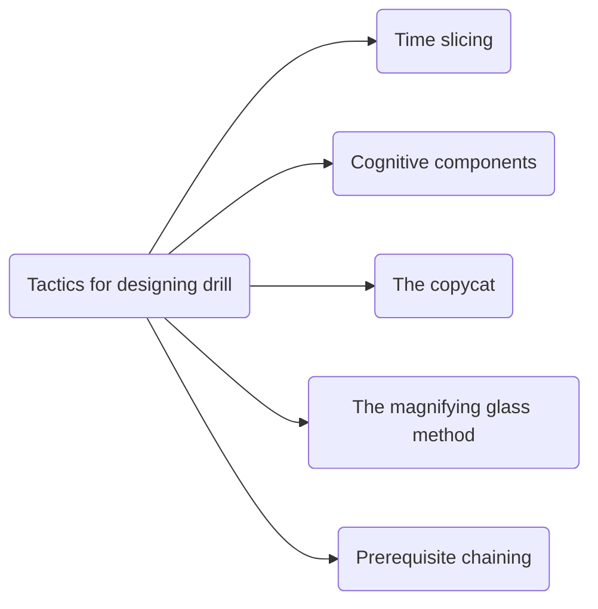
```mermaid
flowchart LR
    a(Tactics for designing drill)
    b(Time slicing)
    c(Cognitive components)
    d(The copycat)
    e(The magnifying glass method)
    f(Prerequisite chaining)
    a-->b
    a-->c
    a-->d
    a-->e
    a-->f
    
```

- Make  hypothesis about what is holding you attack it with drill using direct-then-drill approach.
- Failure is inevitable so when meet a failure, go back a step, learn one of the foundational topic and repeat the exercise.
- Something mentally strenuous provides a greater benefit to learning than something easy.

## 5. Retrieval

- Famous example - Srinivasa Ramanujan (Indian genius mathematician)
### Testing effect

- Self-testing (closed book retrieval)

### Paradox of studying

- Judgments of learning:
    - if task is easy and smooth, the brain believe that it has been learned.
    - if task is hard and difficult, the brain feel that it hasn't been learned.

### Forward-testing

- Retrieval works enhance future learning, even when there is nothing to retrieve yet (testing exam before class even begin).

### Retrieval Tactics

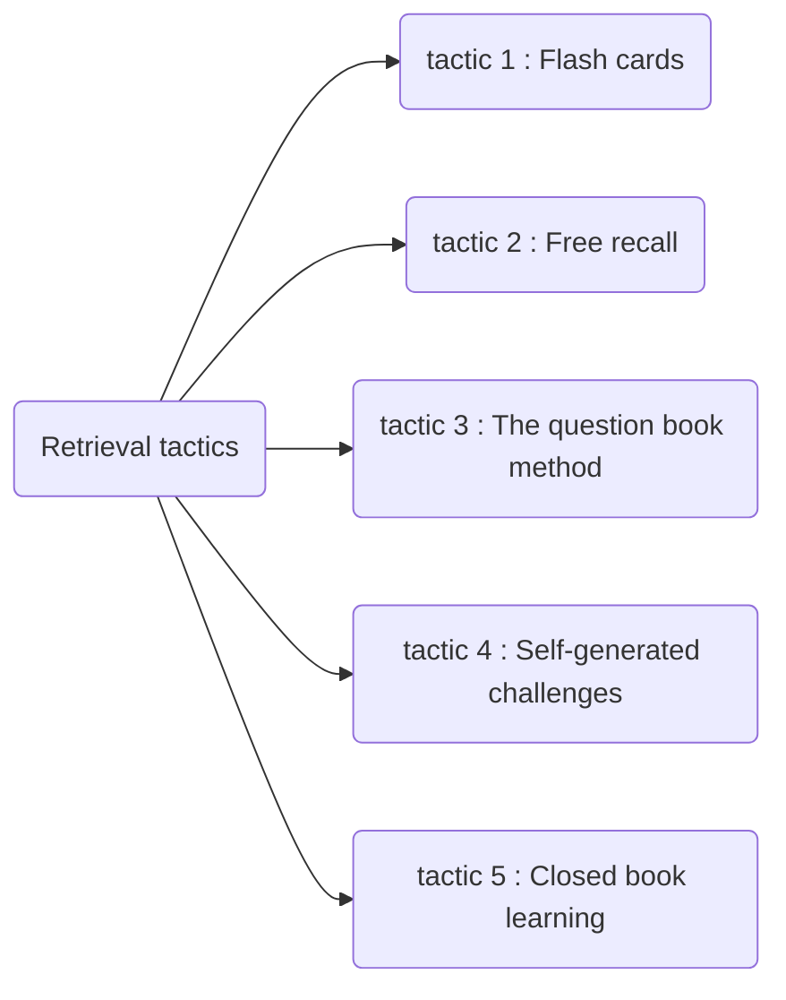
```mermaid
flowchart LR
    a(Retrieval tactics)
    b(tactic 1 : Flash cards)
    c(tactic 2 : Free recall)
    d(tactic 3 : The question book method)
    e(tactic 4 : Self-generated challenges)
    f(tactic 5 : Closed book learning)
    a-->b
    a-->c
    a-->d
    a-->e
    a-->f
```

## 6. Feedback

- The power of information.
- Feedback is an essential ingredient in reaching expert level.
- Lack of feedback can even result declining abilities.
- Feedback works well when it provides useful information that can guide failure learning.
- Feedback back fired when it is aimed at a person's ego (example, personal-praise or personal-criticism).

### 3 types of feedback

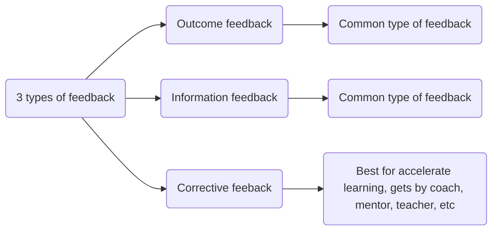
```mermaid
flowchart LR
    a(3 types of feedback)
    b(Outcome feedback)
    b1(Common type of feedback)
    c(Information feedback)
    c1(Common type of feedback)
    d(Corrective feeback)
	d1(Best for accelerate learning, gets by coach, mentor, teacher, etc)
	a-->b-->b1
	a-->c-->c1
	a-->d-->d1
```

- Immediate feedback is the best with delay review.
- Use timer for feedback (retrieval).

### Feedback tactics

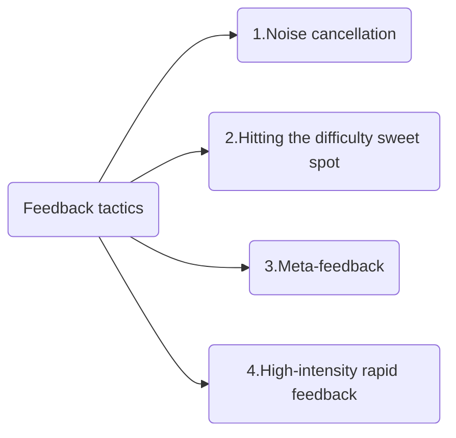
```mermaid
flowchart LR
    a(Feedback tactics)
    b(1.Noise cancellation)
    c(2.Hitting the difficulty sweet spot)
    d(3.Meta-feedback)
    e(4.High-intensity rapid feedback)
	a-->b
	a-->c
	a-->d
	a-->e
```

## 7. Retention

### 3 dominant theories of forgetting

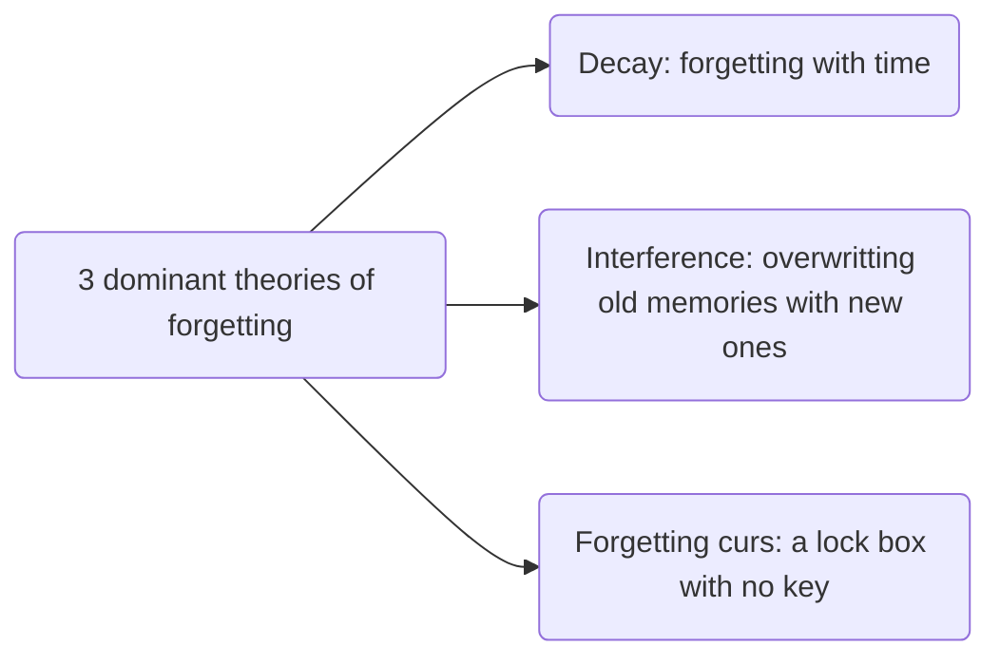
```mermaid
flowchart LR
a(3 dominant theories of forgetting)
b(Decay: forgetting with time)
c(Interference: overwritting old memories with new ones)
d(Forgetting curs: a lock box with no key)
a-->b
a-->c
a-->d
```

### 4 memory mechanisms

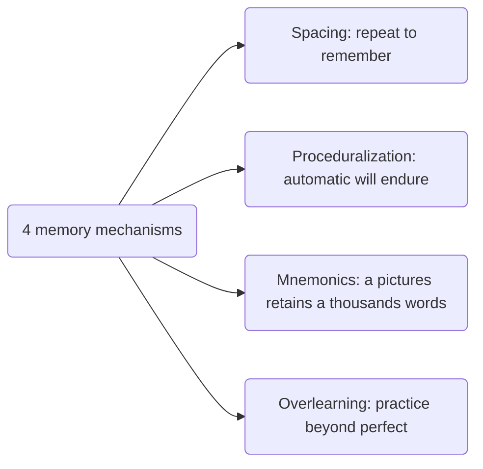
```mermaid
flowchart LR
    a(4 memory mechanisms)
    b(Spacing: repeat to remember)
    c(Proceduralization: automatic will endure)
    d(Mnemonics: a pictures retains a thousands words)
    e(Overlearning: practice beyond perfect)
	a-->b
	a-->c
	a-->d
	a-->e
```

## 8. Intuition

- From Sub-conscious mind
- Famous example - Richards Feynman (American quantum physicist)

### Building Intuition

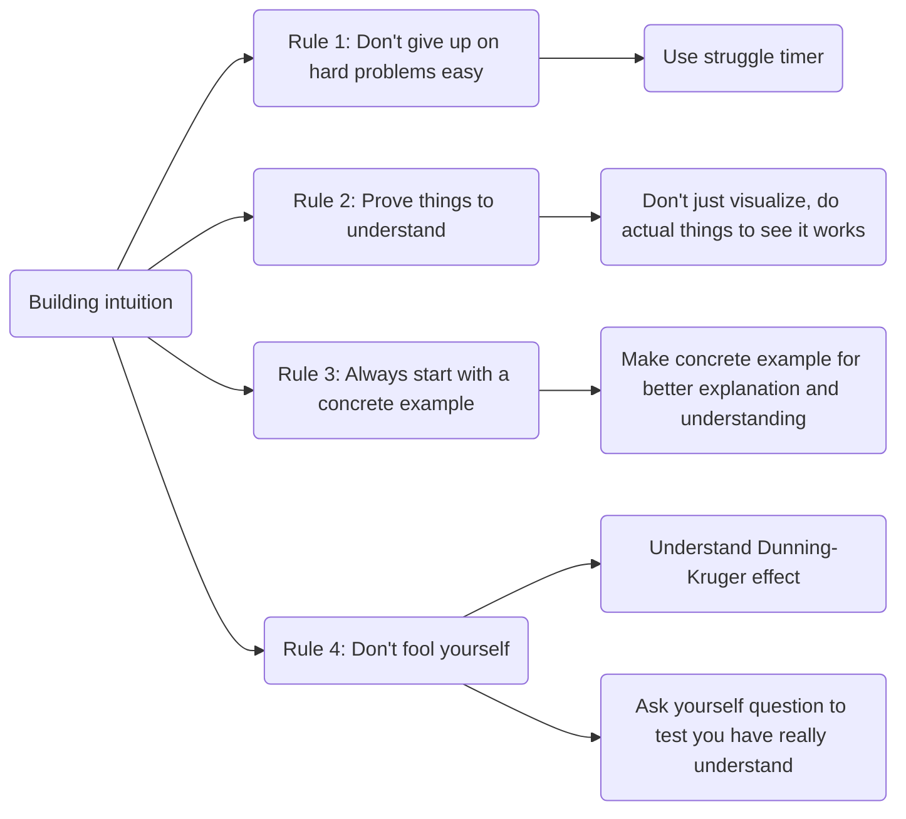
```mermaid
flowchart LR
    a(Building intuition)
    b(Rule 1: Don't give up on hard problems easy)
    b1(Use struggle timer)
    c(Rule 2: Prove things to understand)
    c1(Don't just visualize, do actual things to see it works)
    d(Rule 3: Always start with a concrete example)
    d1(Make concrete example for better explanation and understanding)
    e(Rule 4: Don't fool yourself)
    e1(Understand Dunning-Kruger effect)
    e2(Ask yourself question to test you have really understand)
    a-->b-->b1
    a-->c-->c1
    a-->d-->d1
    a-->e
    e-->e1
    e-->e2
```

### The Feynman Technique

1. Write down concept/problem.
2. In space below, explain the idea:
    - if concept, explain it as simple as it can.
    - if problem, explain how to solve.
3. When stuck, go back to resources (e.g. text book, notes, ...) and find answers.

### Applications of The Feynman Technique

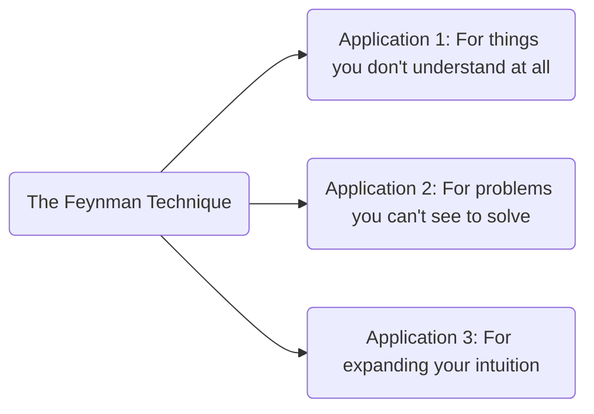
```mermaid
flowchart LR
    a(The Feynman Technique)
    b(Application 1: For things you don't understand at all)
    c(Application 2: For problems you can't see to solve)
    d(Application 3: For expanding your intuition)
    a-->b
    a-->c
    a-->d
```

## 9. Experimentation

- The art of learning itself is a kind of trial and error.
- Have ***the growth mindset***.
- Experimentation is the key to ***mastery***.
- Find your own learning path/originality.

### 3 types of experimentation 

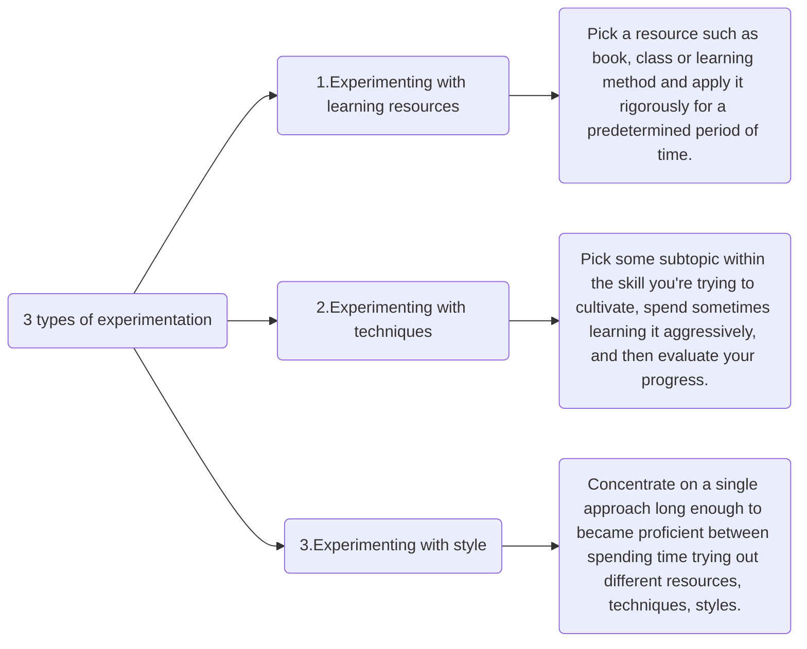
```mermaid
flowchart LR
    a(3 types of experimentation)
    b(1.Experimenting with learning resources)
    b1(Pick a resource such as book, class or learning method and apply it rigorously for a predetermined period of time.)
    c(2.Experimenting with techniques)
    c1(Pick some subtopic within the skill you're trying to cultivate, spend sometimes learning it aggressively, and then evaluate your progress.)
    d(3.Experimenting with style)
    d1(Concentrate on a single approach long enough to became proficient between spending time trying out different resources, techniques, styles.)
    a-->b-->b1
    a-->c-->c1
    a-->d-->d1
```

### How to experiment

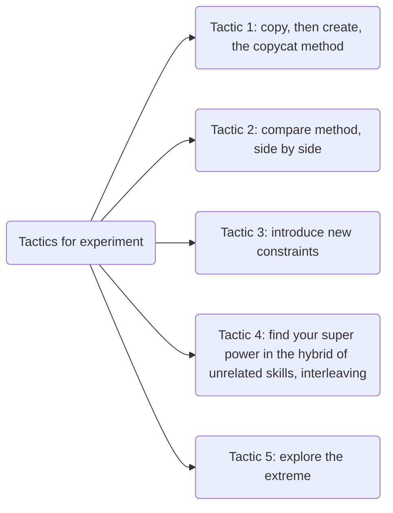
```mermaid
flowchart LR
a(Tactics for experiment)
b(Tactic 1: copy, then create, the copycat method)
c(Tactic 2: compare method, side by side)
d(Tactic 3: introduce new constraints)
e(Tactic 4: find your super power in the hybrid of unrelated skills, interleaving)
f(Tactic 5: explore the extreme)
a-->b
a-->c
a-->d
a-->e
a-->f
```
